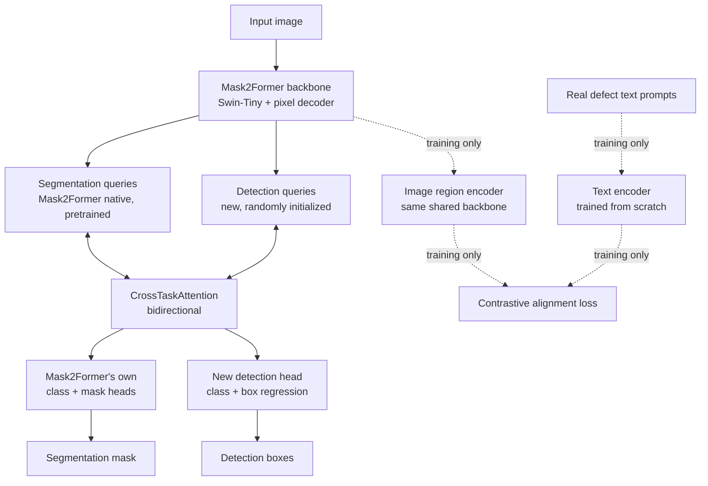

# DefectFormer (v1)

Joint detection + segmentation architecture proposed as this project's novel contribution, built on top of the 7+7 baseline comparison in `baselines/`. Instead of training separate detection and segmentation models, DefectFormer does both from one shared backbone, with a mechanism for the two tasks to inform each other, plus an auxiliary task that grounds what the model learns in real text descriptions of defects during training.

## Architecture



**Backbone**: Mask2Former (Swin-Tiny, `facebook/mask2former-swin-tiny-ade-semantic`), chosen from a real benchmark across the segmentation baselines in this project — it won on every metric, especially Recall_Small (0.714 vs SegNeXt's next-best 0.565), the metric this project is centered on.

**Contribution 1 — cross-task attention.** Mask2Former already carries its own 100 segmentation queries — pretrained vectors refined through masked-attention decoder layers into a class + mask prediction each. DefectFormer adds a second, separate set of 100 detection queries (randomly initialized, no pretrained weights) run through their own decoder, `DetectionQueryDecoder` — a standard, non-masked transformer decoder, since masked attention has no real analog for box coordinates the way it does for masks. Before either set commits to a final prediction, `CrossTaskAttention` lets the two sets attend to each other bidirectionally: segmentation queries can incorporate what the detection queries are finding, and vice versa. This is different from MaskDINO, which decodes a single shared query set two ways — DefectFormer keeps two genuinely separate query sets that inform each other through attention instead of forcing one representation to serve both tasks. After cross-attention, segmentation queries pass through Mask2Former's own pretrained class/mask heads (so segmentation keeps benefiting from Mask2Former's pretrained knowledge, now enriched by the cross-attention), while detection queries pass through a new head trained from scratch with DETR-style Hungarian matching (classification + L1 + GIoU cost).

**Contribution 2 — prompt-grounded auxiliary task (training-only).** Real per-instance defect descriptions (`defect_prompts_v2.json`, 27,230 real geometrically-derived instances) are paired with cropped defect regions in a contrastive (CLIP-style, symmetric InfoNCE) alignment loss. The text encoder is trained from scratch, not a pretrained language model — the real corpus has only 196 unique words across all 571,830 description strings, verified directly. The image side reuses the same shared backbone that also feeds detection and segmentation. This task only exists during training: at inference there's no text available, so this whole branch is dropped, and its only lasting effect is whatever it taught the shared backbone — its gradients reach detection and segmentation purely by being summed into the same backward pass through shared parameters, with no direct query-level interaction with the cross-attention mechanism.

Code layout: `prompt_pair_dataset.py` (aux-task data), `det_seg_cross_attention.py` (detection decoder + cross-attention + detection head), `prompt_alignment_head.py` (aux-task model), `detection_loss.py` (Hungarian matcher + DETR loss), `detection_metrics.py` (single-class COCO-style mAP, size-stratified), `novelty_model.py` (combined model). Training script: `../train_novelty_runpod.py` (RunPod, same scaffolding as this project's other `train_*_runpod.py` scripts).

## Training

```
export WANDB_API_KEY=<key>
export DATASET_ROOT=/path/to/processed_output
export PROMPTS_JSON=/path/to/defect_prompts_v2.json
nohup python -u train_novelty_runpod.py > train.log 2>&1 &
```

50 epochs max (patience 15), batch=4, AdamW (backbone lr=1e-5, head lr=1e-4). bf16 autocast wraps forward passes only; detection/segmentation loss and both Hungarian matchers (Mask2Former's own for masks, the new one for boxes) are forced to fp32 explicitly, to avoid the fp16 NaN-box failure another DETR-style detector in this project hit under plain AMP.

## v1 results (test set, 1920 images, best checkpoint = epoch 45/50)

Column note: `Dice`/`IoU`/`Recall`/`Precision` (overall and per size bucket) are all **segmentation** metrics. `mAP50`/`mAP50_95` are the only **detection** metrics — this model reports both since it does both tasks jointly.

| Metric | Overall | Small | Medium | Large |
|---|---|---|---|---|
| Segmentation Dice | 0.7505 | 0.5083 | 0.6639 | 0.7841 |
| Segmentation IoU | 0.6006 | 0.3408 | 0.4969 | 0.6448 |
| Segmentation Recall | 0.7888 | 0.6587 | 0.7350 | 0.8069 |
| Detection mAP50 | 0.0020 | 0.0004 | 0.0025 | 0.0030 |

Inference: 54.8 ms/image. W&B run: https://wandb.ai/ananyashriram10-manipal/smallDefectDetection/runs/gnlv3xhk

**Conclusion**: the segmentation half of DefectFormer works — Dice and IoU are solid, real numbers on the held-out test set. The detection half does not work in this v1 — mAP50 is effectively zero across every size bucket, including small, despite the full 50-epoch training budget. This v1 should be reported as a working joint architecture for segmentation with detection not yet functional, not as a working joint detector.
