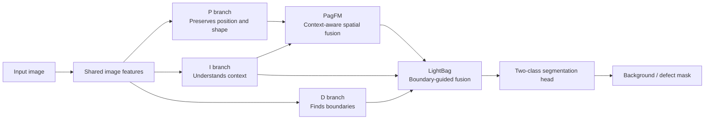
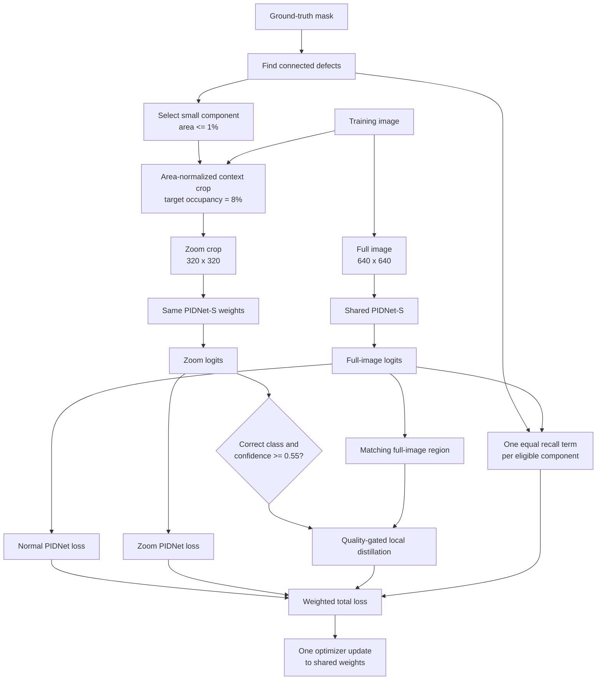

# ANZD-PIDNet

**Area-Normalized Zoom Distillation for small-defect semantic segmentation**

## Goal

Tiny defects occupy very few pixels, so ordinary pixel-averaged training can let them contribute much less learning signal than larger defects and background. ANZD-PIDNet trains a lightweight segmentation model with a magnified view of small defects, while keeping the deployed model unchanged: one RGB image still produces one binary defect mask.

## PIDNet-S: the deployed segmentation model

PIDNet-S is the segmentation network. It has three cooperating branches:

- **P branch:** preserves position, shape, and fine spatial detail.
- **I branch:** learns wider semantic context and suppresses confusing texture.
- **D branch:** focuses on defect boundaries and thin structures.

PagFM transfers useful context into the spatial branch, and LightBag uses boundary information to fuse the three streams before the two-class segmentation head.



The P branch stays relatively high resolution so a tiny crack or spot is less likely to disappear. The I branch supplies global context, while the D branch encourages a sharp outline instead of a blurry blob. PIDNet-S has **7,716,549 parameters**.

## ANZD training flow

ANZD means **Area-Normalized Zoom Distillation**. During training, a ground-truth connected component is selected when it occupies at most 1% of the image. A context crop is chosen so that the defect occupies about 8% of the crop, then resized to `320 x 320`.

The full image and the zoom crop go through the **same PIDNet-S weights**. The two PIDNet boxes below are two forward passes through one model, not two separately trained networks.



The zoom prediction is used as a detached local teacher only when it agrees with the ground truth and is confident enough. Distillation starts after the model has learned basic segmentation and ramps in gradually. The component-balanced term gives every eligible small defect one recall-oriented term, so a 20-pixel defect is not completely dominated by a 5,000-pixel defect.

Conceptually:

```text
Total loss = full-image PID loss
           + 0.5 x zoom PID loss
           + quality-gated zoom-to-full distillation
           + 0.5 x component-balanced recall loss
```

## Inference

All zooming, connected-component selection, teacher gating, and component loss are training-only.


This preserves PIDNet-S's lightweight single-pass deployment behavior.

## Controlled experiment

The four modes isolate the two training contributions while keeping the model, split, seed, optimizer, and evaluation protocol fixed.

| Mode | Full PID loss | Component loss | Zoom PID loss | Zoom-to-full distillation |
|---|---:|---:|---:|---:|
| `baseline` | yes | no | no | no |
| `component` | yes | yes | no | no |
| `zoom` | yes | no | yes | yes |
| `zoom_component` | yes | yes | yes | yes |

The benchmark contains 12,670 paired images with a fixed size-stratified 70/15/15 split: 8,858 train, 1,892 validation, and 1,920 test images. Evaluation includes overall and size-bucket recall, Dice, IoU, precision, false-positive pixels per image, connected-component metrics, latency, throughput, memory, parameters, and MACs.

## Completed `zoom_component` run

The best checkpoint was selected at epoch 43. ANZD-PIDNet substantially improved small-defect recall while keeping overall Dice and IoU at the PIDNet-S baseline level.

| Metric | PIDNet-S baseline | ANZD-PIDNet |
|---|---:|---:|
| Precision | 0.739 | 0.678 |
| Recall | 0.586 | 0.631 |
| Recall — small | 0.414 | **0.657** |
| Recall — medium | 0.607 | 0.664 |
| Recall — large | 0.586 | 0.622 |
| Dice | 0.654 | 0.654 |
| IoU | 0.486 | 0.486 |
| False-positive pixels/image | 5,290.07 | 7,522.64 |
| Inference time/image | 6.836 ms | 3.757 ms* |
| Parameters | 7,716,549 | 7,716,549 |

\*Measured on the completed run's GPU; batch-1 latency was 7.930 ms. The deployed architecture is unchanged, so training-time zoom passes do not add inference passes.

Complete checkpoints, histories, metrics, metadata, and prediction examples are stored in [`results/ANZD_PIDNet_zoom_component_full`](results/ANZD_PIDNet_zoom_component_full). The shared baseline report is [`baselines_small_defect_detection.pdf`](../../baselines_small_defect_detection.pdf).
