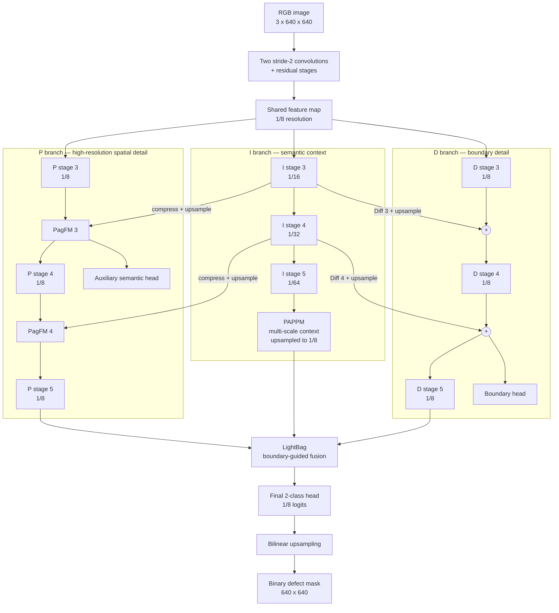
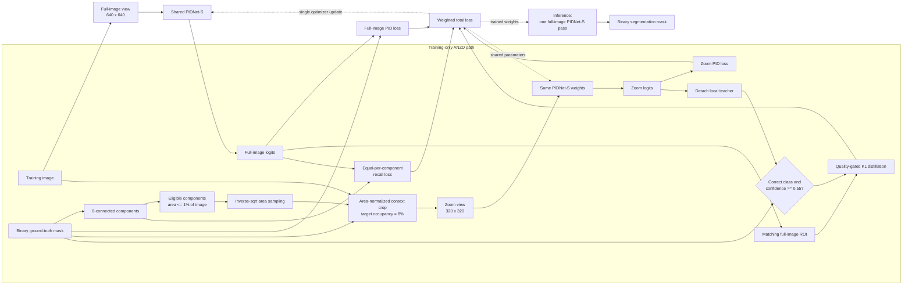

# ANZD-PIDNet

**Area-Normalized Zoom Distillation for small-defect semantic segmentation**

## What we are trying to achieve

Very small defects occupy so few pixels that their learning signal is easily overwhelmed by background and larger regions. ANZD-PIDNet is designed to improve recall for these small connected defects without turning segmentation into detection and without adding a second model at inference. The target is a better small-defect representation while preserving overall mask quality, false-positive behavior, and the lightweight inference cost of PIDNet-S.

The method changes training, not the deployed segmentation task: an RGB image still produces one binary defect mask.

## Model architecture

ANZD-PIDNet uses PIDNet-S as its only segmentation network. PIDNet separates the features needed for dense prediction into three interacting branches:

- **P branch — spatial detail:** remains at high resolution to preserve defect position, shape, and thin structures.
- **I branch — context:** progressively downsamples features to learn semantic context and suppress visually similar background texture.
- **D branch — boundary detail:** learns transitions around defect borders and guides the final fusion.



### How the PIDNet-S parts interact

1. The stem and first residual stages reduce the image to a shared `1/8` feature map.
2. The **I branch** continues to `1/16`, `1/32`, and `1/64` resolution. PAPPM pools this deep feature at several spatial scales, combines local and global context, and returns it to `1/8` resolution.
3. The **P branch** stays at `1/8` resolution. Two PagFM modules selectively inject context from the I branch while retaining high-resolution spatial information.
4. The **D branch** also stays at `1/8`. Difference features from I stages 3 and 4 are compressed, upsampled, and added to the D stream so it can focus on semantic boundaries rather than arbitrary image edges.
5. **LightBag** uses the D feature as boundary attention to combine P-branch detail with PAPPM context. The final head predicts background and defect logits, which are upsampled to the input resolution.
6. The auxiliary P semantic head and D boundary head supply training supervision. The final semantic head is the prediction used for evaluation.

The exact small configuration is `m=2`, `n=3`, base width `32`, PAPPM width `96`, head width `128`, and two output classes. It contains **7,716,549 parameters**.

## ANZD training experiment and flow

ANZD adds a second view of small defects during training. The full image and the zoom crop are processed by the same PIDNet-S instance, so there is one parameter set and one optimizer update.



### Area-normalized zoom

For an eligible component with area `A`, width `w`, and height `h`, the square crop side is

```text
s = max(sqrt(A / r_target), context_scale * max(w, h), minimum_side)
```

The default target occupancy is `r_target=0.08`, context scale is `1.5`, and minimum side is `24` pixels. The crop is clipped to the image, lightly jittered, and resized to `320 x 320`. RGB uses bilinear interpolation; the mask uses nearest-neighbor interpolation. Sampling components with inverse-square-root area weighting favors the smallest defects without selecting the same component deterministically.

### Shared-weight zoom supervision

The zoom view receives the same PID loss as the full view: auxiliary semantic supervision, final semantic supervision with online hard-example mining, weighted boundary supervision, and boundary-aware semantic supervision. Because the zoom pass uses the same model weights, it learns a higher-resolution local representation without introducing a separate teacher network.

The zoom final logits then act as a detached local teacher for the corresponding full-image ROI. A pixel contributes to distillation only when the teacher predicts its ground-truth class correctly and has at least `0.55` confidence. Distillation starts at epoch 5 and ramps over five epochs, reducing the risk of reinforcing poor early predictions.

### Component-balanced recall

Pixel-averaged losses allow a large component to contribute far more foreground gradient than a tiny component. The component loss instead computes one recall-oriented probability penalty per eligible connected component and averages those terms. Every small component therefore receives equal weight, while the ordinary PID losses continue to constrain background and boundary errors.

### Training objective

```text
L_total = L_PID(full)
        + 0.5 * L_PID(zoom)
        + alpha(epoch) * 1.0 * L_KD(zoom -> full ROI)
        + 0.5 * L_component
```

`alpha(epoch)` is the distillation warm-up. The zoom PID loss, distillation loss, and component loss exist only during training; validation and inference use the full-image PIDNet-S path.

### Experiment design

The experiment separates the two proposed contributions with four controlled modes:

| Mode | Full PID loss | Component loss | Zoom PID loss | Zoom-to-full distillation |
|---|---:|---:|---:|---:|
| `baseline` | yes | no | no | no |
| `component` | yes | yes | no | no |
| `zoom` | yes | no | yes | yes |
| `zoom_component` | yes | yes | yes | yes |

All modes use the same PIDNet-S initialization, optimizer, image size, data split, seed, epoch limit, and early-stopping rule. The 12,670 paired samples are stratified within each `(dataset, size)` group into 8,858 training, 1,892 validation, and 1,920 test samples. The best checkpoint is selected using validation Dice before the test set is evaluated.

The comparison is intended to answer three questions:

1. Does area-normalized zoom distillation improve small-defect and component recall over the PIDNet-S baseline?
2. Does equal-per-component supervision add recall beyond zoom training without an unacceptable increase in false positives?
3. Does the complete method preserve overall Dice and the single-pass inference behavior of PIDNet-S?

The primary evaluation measures are small/medium/large recall, pixel Dice and IoU, precision, specificity, false-positive pixels per image, component precision/recall/F1 at IoU `0.10` and `0.50`, mean best-component IoU, latency, throughput, memory, parameters, and MACs. Results will be added only after the controlled runs are completed.
