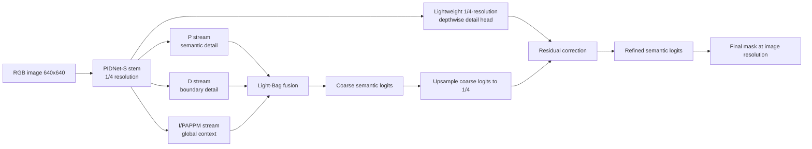
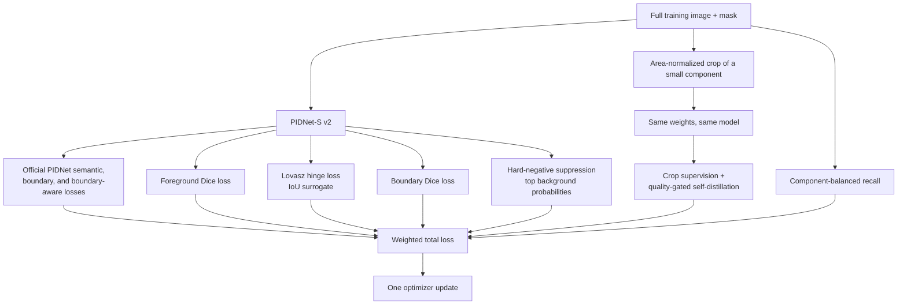

# ANZD-PIDNet v2

ANZD-PIDNet v2 is a segmentation-only experiment for small surface defects. It
keeps the compact PIDNet-S real-time design and targets the failure mode seen in
v1: masks that detect a defect but have soft, oversized boundaries or isolated
false-positive pixels. The goal is to increase Dice, IoU, precision, and
small-defect recall beyond the v1 Dice/IoU (0.654/0.486) while keeping the
single-image inference path short.

## Architecture

PIDNet has three complementary streams. The **P stream** predicts the semantic
defect mask, the **D stream** focuses on boundary/detail cues, and the **I/PAPPM
stream** supplies inexpensive global context. PIDNet's Light-Bag fusion combines
these streams before the final semantic head.

The v2 head reuses the stem feature that already exists at 1/4 resolution. A
depthwise 3x3 convolution and two small pointwise/fusion convolutions predict a
residual correction to the coarse logits. The last correction layer starts at
zero, so the model initially behaves like PIDNet-S and learns only the boundary
adjustment. This adds very few parameters (about 3.6k with PIDNet-S settings) and
one normal forward pass; it is not a second model and does not require test-time
crops.

## Training flow

The original ANZD zoom/component objectives remain training-only. A small
component is enlarged for supervision, then the crop prediction can teach the
corresponding full-image region only when it agrees with the ground truth and is
confident. The model weights are shared; there is no separately trained teacher.

V2 adds four metric-aware terms:

- foreground Dice directly rewards overlap with the defect region;
- Lovasz hinge is a differentiable surrogate for foreground IoU;
- boundary Dice rewards the contour branch where masks need to be tight;
- hard-negative suppression penalizes only the highest-probability background
  pixels, reducing the red false-positive halos seen in v1.

After the best checkpoint is selected, a threshold grid is evaluated on the
validation split only. The threshold with the highest validation Dice subject to
the configured small-defect recall floor is then frozen for test metrics and
qualitative panels. No test labels are used for calibration.

Results are intentionally not included until the v2 experiment has been run.
