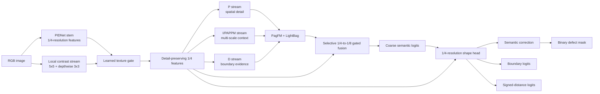
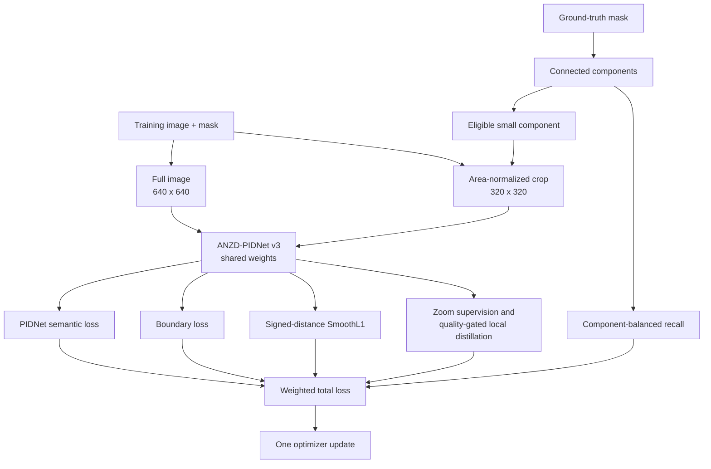
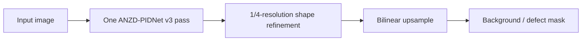

# ANZD-PIDNet v3

**A fast, shape-aware extension of ANZD-PIDNet V1 for small-defect semantic segmentation**

## Goal

ANZD-PIDNet v3 keeps the V1 area-normalized zoom/component training idea and
upgrades the deployed PIDNet path to address the errors seen in the V1/V2
visualizations: texture-driven false positives, missing thin structures, and
coarse mask boundaries. The model remains segmentation-only and produces one
binary defect mask from one image. It does not use SAM/SAM2 weights, prompts, or
distillation.

## Architecture

The model starts with PIDNet's three complementary streams. The P stream keeps
spatial detail, the I/PAPPM stream provides wider context, and the D stream
models boundary evidence. V3 adds a shallow local-contrast stream at 1/4
resolution, gates it into the early features, and selectively fuses those
features back into the 1/8-resolution PIDNet context. A native 1/4-resolution
shape head then predicts the semantic correction, a boundary map, and a signed
distance map before the final upsampling.

### What each addition does

- **Local contrast gate:** gives the network a cheap view of local intensity
  changes and learns when to suppress repetitive surface texture.
- **Selective scale fusion:** lets high-resolution detail influence the semantic
  representation without running a full high-resolution backbone.
- **Shape head:** uses detail and coarse context together. The boundary output
  describes the contour, while the signed-distance output gives the decoder a
  smooth inside/outside shape signal.
- **Wider PIDNet channels:** the default width is 40 instead of V1's 32. The
  exact parameter count and MACs are recorded automatically in `summary.csv`.

All of these modules are part of the deployed single forward pass. The shape
head is initialized with a zero semantic correction, so the first optimization
steps begin from the stable coarse PIDNet behavior while the new shape features
learn.

## ANZD training flow

V3 retains V1's training-only area-normalized zoom and component-balanced terms.
The full image and an optional small-defect crop use the same V3 weights. The
crop is enlarged only to increase the learning signal for tiny components; it is
not a second model and it is not used at inference.

The distance target is positive inside a defect and negative outside it. It is
clipped and normalized before the SmoothL1 objective. The original V1 zoom and
component terms remain training-only, so they add no inference passes.

## Inference flow

No crop selection, teacher branch, or SAM/SAM2 model is used at inference. The
trainer benchmarks batch-1 latency, batched throughput, peak memory, parameters,
and convolution MACs alongside the segmentation metrics.

## Controlled experiment

The V1 modes remain available through `METHOD`, so the ANZD training contribution
can be isolated while keeping the new v3 architecture, dataset split, and metric
definitions fixed.

| Mode | Full PID loss | Component recall | Zoom supervision | Local distillation |
|---|---:|---:|---:|---:|
| `baseline` | yes | no | no | no |
| `component` | yes | yes | no | no |
| `zoom` | yes | no | yes | yes |
| `zoom_component` | yes | yes | yes | yes |

The benchmark uses the fixed size-stratified 70/15/15 split from V1: 8,858
training images, 1,892 validation images, and 1,920 test images. Results include
overall and size-bucket recall, Dice, IoU, precision, false-positive pixels per
image, component metrics, inference latency, throughput, memory, parameters, and
MACs. mAP is intentionally blank because this is binary semantic segmentation.

## Output artifacts

Each run writes checkpoints, training history, validation metrics, deterministic
prediction panels, `summary.csv`, and
`run_metadata.json` under the configured run directory. The prediction panels use
green for true positives, red for false positives, and blue for false negatives.

Results are intentionally not included until the v3 experiment has been run.
