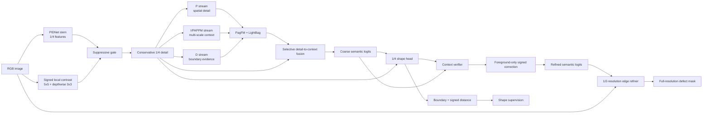
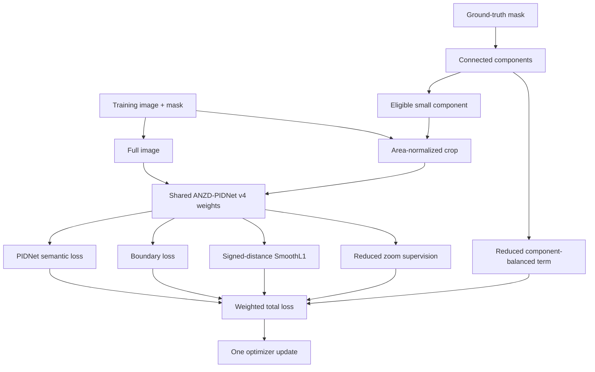
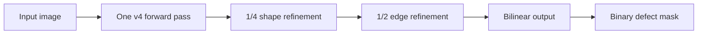

# ANZD-PIDNet v4

## Quality-first small-defect segmentation

ANZD-PIDNet v4 is a segmentation-only extension of ANZD-PIDNet v3. It is
designed for the observed failure mode in v3: the model finds many small
defects, but the predicted regions are often too thick or extend into nearby
surface texture. V4 therefore spends its limited extra computation on shape
quality and conservative semantic refinement instead of widening the full
backbone.

The objective is to improve precision, Dice, IoU, and boundary tightness while
retaining PIDNet's single-image, single-forward-pass inference. V4 does not use
SAM/SAM2 weights, prompts, or an external teacher. The optional ANZD zoom
consistency term is self-distillation between two views of the same model and
is used only during training.

## Architecture

PIDNet still supplies the main representation:

- **P stream:** high-resolution spatial detail.
- **I/PAPPM stream:** multi-scale context and defect-versus-background evidence.
- **D stream:** boundary difference features.

V4 adds four focused pieces around those streams.

1. **Suppressive contrast gate.** A shallow 1/4-resolution contrast branch is
   converted to a signed, bounded residual. A learned suppression gate decides
   whether local contrast is useful or looks like repetitive texture. This is
   more conservative than v3's direct additive texture response.
2. **Context-verified shape head.** The 1/4-resolution shape head predicts a
   boundary map and signed distance map. Its semantic correction is one signed
   foreground channel, not an unconstrained two-class delta. A verifier uses
   the coarse foreground probability to limit corrections in obvious
   background regions.
3. **Half-resolution edge refiner.** A small RGB-plus-logit branch runs once at
   1/2 resolution. Depthwise spatial filtering and pointwise mixing produce a
   bounded foreground correction that is bilinearly returned to the input
   resolution. It is a refinement head, not a second backbone.
4. **Operating-point calibration.** After the best checkpoint is selected, a
   validation-only threshold search chooses the cutoff that maximizes Dice while
   protecting a minimum small-defect recall. This changes no model weights and
   adds no inference branch.

### Why the correction is foreground-only

The coarse PIDNet output already contains a two-class semantic decision. V4
does not let the shape head independently move both class logits. Instead, it
predicts one signed foreground correction and adds it only to the foreground
logit. The background logit remains anchored to the coarse decision, which
reduces accidental background activation while still allowing a weak tiny
defect to be recovered.

### Why the edge refiner is lightweight

The refiner uses 24 channels by default, a depthwise 3x3 convolution, and 1x1
mixing at half resolution. It sees the RGB image and the already-computed
semantic logits, so it does not duplicate PIDNet's context backbone. Its output
is bounded with `tanh` and gated by local edge evidence.

## Training flow

The full image and optional small-component crop use the same v4 weights. The
crop is a training-only magnification that increases the learning signal for a
tiny component; it is not selected or evaluated during inference.

The v4 quality-first run keeps the proven semantic, boundary, and signed-
distance objectives. Zoom and component supervision are deliberately reduced
from v3 defaults so they improve small-defect recall without overwhelming the
shape and semantic terms. V4 does not add an explicit false-positive loss in
this first experiment; false positives remain a reported diagnostic.

The validation threshold is calibrated only after training, using the
validation split and a fixed minimum small-recall floor. The test split is not
consulted when choosing the threshold.

## Inference flow

There is no crop selection, teacher model, prompt, or second backbone at
inference. The additional edge branch is the only intentional latency tradeoff
in v4.

## Controlled experiment

The dataset split and metric definitions remain aligned with v1--v3: a fixed
size-stratified 70/15/15 split, seed 42, and 640-pixel inputs. The trainer
records overall metrics, size-bucket recall, Dice, IoU, precision, specificity,
accuracy, component metrics, threshold, inference latency, throughput, peak
memory, parameters, and convolution MACs.

The primary quality targets are tighter visual boundaries and higher Dice/IoU
without giving up v3's small-defect recall. The v4 run is an experiment, not a
guarantee of SAM-level scores; the result must be judged using the same
evaluation protocol as the SAM/SAM2 baselines.

## Output artifacts

Each run writes checkpoints, training history, validation metrics, deterministic
prediction panels, threshold calibration, `summary.csv`, and `run_metadata.json`
under the configured output directory. Prediction panels use green for true
positives, red for false positives, and blue for false negatives.

## Files

- `pidnet.py` — PIDNet v4 model, refinement heads, and losses.
- `train_runpod.py` — fixed-split training, evaluation, calibration, and
  benchmarking.
- `zoom_utils.py` — crop geometry, component targets, and segmentation metrics.
- `verify.py` — dependency, geometry, shape, finite-gradient, and metric checks.
- `.env.example` — reproducible experiment defaults.
