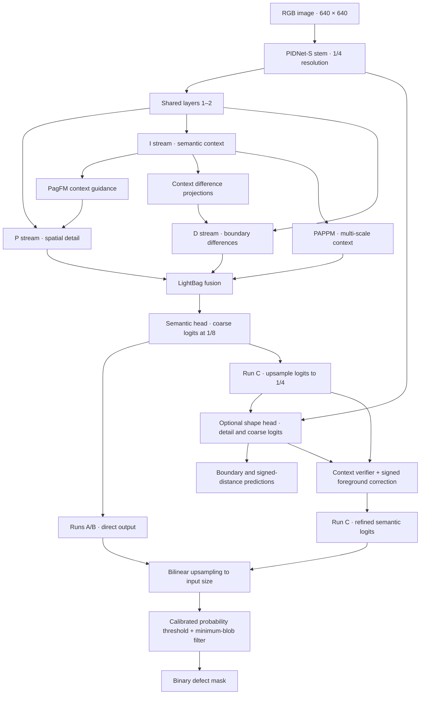
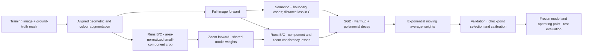

# ANZD-PIDNet v5

**Pretrained, recipe-first ANZD-PIDNet.**

## Why v5 exists

v1–v4 changed the architecture but kept a training recipe that could not
measure those changes:

| | v1–v4 | Problem |
|---|---|---|
| Initialization | from scratch | SegFormer-B0 starts from ImageNet (`nvidia/mit-b0`) |
| Optimizer | AdamW, lr 6e-5, constant | a transformer *fine-tuning* LR on a CNN trained from scratch |
| Batch / EMA | 4 / none | v4 validation Dice swung 0.54 ↔ 0.64 between epochs |
| Augmentation | none | — |

The validation fluctuations motivate a controlled comparison; they do not
establish statistical significance or rule out architecture gains. V5 tests
a stronger training recipe first, then adds ANZD and shape refinement in
separate ablations.

## What v5 changes

**Model** (`pidnet.py`)

- PIDNet-S dimensions (planes 32, PAPPM 96, head 128), so the **official
  ImageNet PIDNet-S checkpoint** loads by name and shape. Without the shape
  head, v5 is exactly PIDNet-S (7,716,549 parameters).
- Optional v3 shape head (boundary + signed distance) with v4's
  foreground-only, context-verified correction (`SHAPE_HEAD=1`, 7,704,072
  parameters, because it replaces PIDNet's auxiliary D head).
- Removed: v3/v4 contrast gate, selective scale fusion, v4 edge refiner,
  simplifying the model for the controlled comparison.

## Architecture diagram

Runs A and B share the PIDNet-S inference architecture. Run C adds the
optional shape head. ImageNet weights initialize matching layers; the loader
requires at least 95% coverage of the core trunk. New shape-head parameters
are learned during training.



Boundary and distance predictions supervise the shape head during training.
Inference uses one model forward pass; ANZD crops are training-only. The
threshold and blob-size cutoff are selected on validation data and frozen
before test evaluation. Blob filtering runs on CPU and is timed separately.

### Training and controlled runs



All three runs use the same split and seed. B minus A measures the ANZD
contribution; C minus B measures the optional shape head's contribution.
These diagrams describe the implementation and planned experiments, not
completed v5 results.

**Recipe** (`train_runpod.py`)

| Setting | v5 default |
|---|---|
| Init | ImageNet PIDNet-S. The run **aborts** if < 95% of the trunk (`conv1`, `layer1–5`) loads |
| Optimizer | SGD, momentum 0.9, lr 0.01, weight decay 5e-4 |
| Schedule | 2-epoch linear warmup, then poly (power 0.9), per iteration |
| EMA | decay 0.999. EMA weights are validated, selected, tested, and saved |
| Batch / epochs | 8 / 100, patience 30 |
| Augmentation | horizontal/vertical flip, scale 0.75–1.5 (crop or reflect-pad), brightness/contrast ±0.2 |
| Loss | official PIDNet OHEM + boundary terms; signed-distance 0.25 (shape head); ANZD zoom 0.35 / distillation 0.5 / component 0.3 (unchanged from v4) |

**Operating point** (validation only, after training)

1. Probability threshold with the best validation Dice, subject to small-defect recall ≥ 0.60.
2. Minimum predicted-blob size (0–256 px) at that threshold, same rule.

Test is evaluated once with both frozen. `summary.csv` reports metrics with
and without the blob filter (`*_No_Postprocess`), and the filter's CPU time
separately from model latency.

## Run the full model once

The selected budget-conscious run is `METHOD=zoom_component SHAPE_HEAD=1`.
Runs A and B below are optional comparisons; neither must run before the full
model. Before starting a paid RunPod session, put a PIDNet-S ImageNet
checkpoint at `PRETRAINED_PATH`. The original author's individual download
link currently returns 404. A [public Zenodo mirror](https://zenodo.org/records/14606189)
provides `PIDNet_S_ImageNet.pth.tar` (MD5
`0d25ff46681c795d3c7bc8eb6aa62e76`). The local copy passed a safe
PyTorch load and matched all 162 of 162 v5 core trunk tensors. The mirror is
not maintained by the PIDNet authors, so its original provenance cannot be
confirmed from the surviving official link. The trainer checks that at least
95% of the core trunk loads before training.

```bash
cd /workspace/mandi
export DATASET_ROOT=/workspace/dataset
export PRETRAINED_PATH=/workspace/pretrained/PIDNet_S_ImageNet.pth.tar
test -s "$PRETRAINED_PATH"
python novelty_experiments/anzd_pidnet_v5/verify.py
METHOD=zoom_component SHAPE_HEAD=1 PRETRAINED_DOWNLOAD=0 \
  nohup python -u novelty_experiments/anzd_pidnet_v5/train_runpod.py > v5_full.log 2>&1 &
tail -f v5_full.log
```

Set `WANDB_API_KEY` for online logging or `WANDB_MODE=disabled`. The checkpoint
preflight prevents the trainer from spending paid pod time attempting an
unavailable download.

## Optional ablation configurations

These use the same seed and split if a comparison is needed later.

| Run | Command | What it shows |
|---|---|---|
| **A** | `METHOD=baseline SHAPE_HEAD=0` | Fair PIDNet-S reference (pretrained + v5 recipe). Replaces the from-scratch PIDNet-S row. |
| **B** | `METHOD=zoom_component SHAPE_HEAD=0` | ANZD's contribution = B − A |
| **C** | `METHOD=zoom_component SHAPE_HEAD=1` | Full v5. Shape head contribution = C − B |

The trainer can attempt to download `PIDNet_S_ImageNet.pth.tar` with `gdown`
when `PRETRAINED_DOWNLOAD=1`, but the [official PIDNet README](https://github.com/XuJiacong/PIDNet)
warns that its individual links may no longer work. Check the log for the
`ImageNet pretrained load` report; `core_coverage` must be at least 0.95.

## Go / no-go checkpoints

- **Epoch 1:** `core_coverage` printed ≥ 0.95 (enforced), and loss is finite.
- **During the full run:** inspect EMA validation trends and training stability.
  `clipped_batch_fraction` near 1.0 in `training_history.csv` means
  `GRAD_CLIP_NORM` is throttling SGD; raise it.
- **After the full run:** evaluate its frozen checkpoint and calibrated
  operating point. A single run measures full-model performance but cannot
  isolate the contributions of ANZD or the shape head.

## Outputs

Per run, under `BASE_DIR/final_outputs/<RUN_NAME>/`: `best_model.pt` /
`last_model.pt` (with `ema_state_dict`), `training_history.csv` (LR,
gradient norm, clipped fraction, EMA val metrics), `threshold_calibration.csv`,
`min_blob_calibration.csv`, `evaluation_metrics.csv`,
`evaluation_metrics_no_postprocess.csv`, `summary.csv`, `run_metadata.json`,
and prediction panels (green TP / red FP / blue FN).

## Files

- `pidnet.py`: v5 model, ImageNet loader with coverage report, losses.
- `train_runpod.py`: training, EMA, calibration, evaluation, benchmarking.
- `zoom_utils.py`: ANZD crops/losses, metrics, blob filter, augmentation.
- `verify.py`: parameter count = PIDNet-S, pretrained-load coverage (and the
  official checkpoint if present), loss/gradient checks, blob-filter math,
  image/mask augmentation alignment.
- `.env.example`: all v5 defaults.
